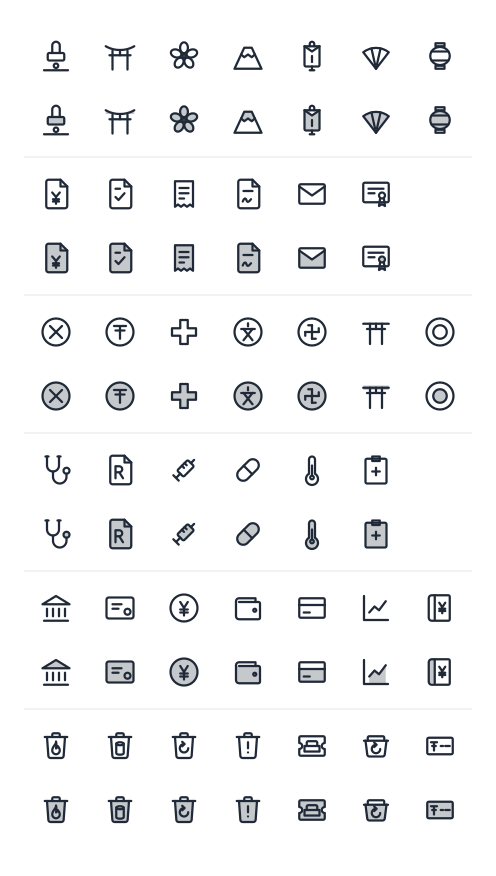

# mue-icons

🇬🇧 [English version below](#english)

印鑑、帳票、地図記号、医療、金融、ゴミ分別など、**日本の暮らしや仕事で使うアイコン**を集めた SVG アイコンライブラリです。MIT ライセンス。

- 🇯🇵 日本ならではのモチーフ(はんこ、鳥居、お守り、〒、燃えるゴミ、請求書、診察券…)
- 🎨 すべて同じ規格(24px グリッド・線幅 1.5・角丸)でそろったデザイン
- 🌓 **line**(線)と **duotone**(2トーン)の2スタイル
- 🌈 色は `currentColor`。テキストと同じ色で表示され、ダークモードにも対応しやすい
- 📦 React / Vue 3 / 素の JavaScript / SVG スプライト / WordPress に対応
- 🌲 使うアイコンだけがバンドルされます(ツリーシェイキング対応)

> 現在は **v0.1.0** です。収録数は 40 アイコンで、順次追加していきます。



## インストール

使う環境に合わせて、どれか1つを入れてください。

| 使い方 | パッケージ | インストール |
|---|---|---|
| React(17 以上) | `mue-icons-react` | `npm install mue-icons-react` |
| Vue 3 | `mue-icons-vue` | `npm install mue-icons-vue` |
| フレームワークなし | `mue-icons` | `npm install mue-icons` |
| SVG スプライト(`<use>`) | `mue-icons-sprite` | `npm install mue-icons-sprite` |
| WordPress | プラグイン | 下の「WordPress」を参照 |

ESM のみ提供します。

## 使い方

### React

```jsx
import { HankoIcon, ToriiIcon } from 'mue-icons-react';

<HankoIcon size={32} variant="duotone" title="印鑑" />
<ToriiIcon />
```

コンポーネント名は「アイコン名をパスカルケースにして `Icon` を付けたもの」です(`trash-burnable` → `TrashBurnableIcon`)。

### Vue 3

```vue
<script setup>
import { InvoiceIcon } from 'mue-icons-vue';
</script>

<template>
  <InvoiceIcon :size="24" variant="duotone" title="請求書" />
</template>
```

### フレームワークなし

```js
import { bank } from 'mue-icons';
import { renderSvg } from 'mue-icons/runtime';

el.innerHTML = renderSvg(bank, { variant: 'line', size: 24, title: '銀行' });
```

アイコンのデータ名はキャメルケースです(`trash-burnable` → `trashBurnable`)。

### SVG スプライト

```html
<svg width="24" height="24" aria-hidden="true">
  <use href="/sprite.svg#mue-hanko-line" />
</svg>
```

`sprite.svg` は `mue-icons-sprite/sprite.svg` を配信ディレクトリにコピーして使います。ID は `mue-<アイコン名>-<line|duotone>` です。

### WordPress

プラグイン(`packages/wordpress/mue-icons`)を `wp-content/plugins/` に置いて有効化すると、ショートコードで使えます。

```
[mue_icon name="hanko" variant="duotone" size="32" label="印鑑"]
```

## オプション

| 項目 | 内容 | 既定値 |
|---|---|---|
| `size` | 幅・高さ(px) | `24` |
| `variant` | `line` または `duotone` | `line` |
| `title`(WordPress は `label`) | アイコンの名前。指定すると読み上げ対象になります | なし |

- 色は親要素の `color` に従います。CSS で変更できます。
- duotone の副色(面の色)は CSS 変数 `--icon-secondary` で変えられます。指定しない場合は主色の薄い色になります。

  ```css
  .icon { color: #1d4ed8; --icon-secondary: #f59e0b; }
  ```

- `title` を付けると `role="img"` と名前が付き、付けない場合は装飾扱い(`aria-hidden`)になります。意味を持つアイコンには `title` を付けてください。

## アイコン一覧

| カテゴリ | アイコン名 |
|---|---|
| 日本の文物 | `hanko` `torii` `sakura` `fuji` `omamori` `sensu` `chochin` |
| 帳票 | `invoice` `application` `receipt` `contract` `envelope` `certificate` |
| 地図記号 | `map-koban` `map-post-office` `map-hospital` `map-school` `map-temple` `map-shrine` `map-city-hall` |
| 医療 | `stethoscope` `prescription` `syringe` `pill` `thermometer` `karte` |
| 金融 | `bank` `promissory-note` `yen-coin` `wallet` `credit-card` `chart-line` `passbook` |
| 生活 | `trash-burnable` `trash-non-burnable` `trash-recyclable` `trash-hazardous` `trash-oversized` `plastic-mark` `postal-code` |

上の画像は `pnpm preview` で再生成できます(`docs/preview.svg`)。アイコンを追加したら更新してください。

検索付きのプレビューは、リポジトリで `pnpm build` したあと `site/index.html` を開くと見られます(日本語・英語のタグで検索できます)。

## 地図記号・公的マークについて

`map-*` や、ゴミ分別・プラマークなどのアイコンは、**着想を得た独自デザイン**です。公的機関が定める記号・マークの図形データをそのまま転載したものではありません。国土地理院などの公的な記号を正確に使いたい場合は、各機関の利用条件を確認してください。

## バージョンと互換性

- [SemVer](https://semver.org/lang/ja/) に従います。全パッケージは同じバージョンで同時にリリースします。
- アイコン名・スタイルの**削除は major バージョンのみ**です。
- 名前を変えるときは旧名も使えるまま残すので、アップデートで壊れません。

## コントリビュート

アイコンの追加や修正は歓迎です。デザインの規格と手順は [CONTRIBUTING.md](CONTRIBUTING.md) を読んでください。ルールは `pnpm lint` が自動で検査します。

```bash
pnpm install
pnpm test      # lint + build + 生成物のテスト
pnpm compat    # 後方互換性チェック
```

- アイコン原本は `svg/<line|duotone>/<名前>.svg`、メタデータは `icons.json` です。`dist/` と `site/` は自動生成物です。

## メンテナ向け: リリース手順

```bash
pnpm version:set 0.2.0   # 全パッケージと WordPress プラグインのバージョンを揃える
pnpm test && pnpm compat
pnpm compat:update       # 今回のリリース内容をスナップショットへ記録
pnpm -r publish --access public
```

WordPress プラグインは `pnpm build` 後に `packages/wordpress/mue-icons` を zip にして配布します(`assets/` は生成物です)。

## ライセンス

[MIT](LICENSE)

---

<a id="english"></a>

# mue-icons (English)

An SVG icon library of **icons for Japanese daily life and work**: name seals, business forms, map symbols, medical, finance, garbage sorting and more. MIT licensed.

- 🇯🇵 Distinctly Japanese motifs (hanko, torii, omamori, postal mark 〒, burnable trash, invoice, clinic card…)
- 🎨 One consistent spec (24px grid, 1.5 stroke width, rounded corners)
- 🌓 Two styles: **line** and **duotone**
- 🌈 Colors use `currentColor`, so icons follow the text color and work well with dark mode
- 📦 Supports React / Vue 3 / plain JavaScript / SVG sprite / WordPress
- 🌲 Only the icons you use are bundled (tree-shakable)

> Currently **v0.1.0** with 40 icons. More will be added over time.

## Installation

Install whichever one fits your environment.

| Usage | Package | Install |
|---|---|---|
| React (17+) | `mue-icons-react` | `npm install mue-icons-react` |
| Vue 3 | `mue-icons-vue` | `npm install mue-icons-vue` |
| No framework | `mue-icons` | `npm install mue-icons` |
| SVG sprite (`<use>`) | `mue-icons-sprite` | `npm install mue-icons-sprite` |
| WordPress | Plugin | See "WordPress" below |

ESM only.

## Usage

### React

```jsx
import { HankoIcon, ToriiIcon } from 'mue-icons-react';

<HankoIcon size={32} variant="duotone" title="Name seal" />
<ToriiIcon />
```

Component names are the icon name in PascalCase plus `Icon` (`trash-burnable` → `TrashBurnableIcon`).

### Vue 3

```vue
<script setup>
import { InvoiceIcon } from 'mue-icons-vue';
</script>

<template>
  <InvoiceIcon :size="24" variant="duotone" title="Invoice" />
</template>
```

### Without a framework

```js
import { bank } from 'mue-icons';
import { renderSvg } from 'mue-icons/runtime';

el.innerHTML = renderSvg(bank, { variant: 'line', size: 24, title: 'Bank' });
```

Icon data names are camelCase (`trash-burnable` → `trashBurnable`).

### SVG sprite

```html
<svg width="24" height="24" aria-hidden="true">
  <use href="/sprite.svg#mue-hanko-line" />
</svg>
```

Copy `mue-icons-sprite/sprite.svg` into your served directory. IDs are `mue-<icon-name>-<line|duotone>`.

### WordPress

Place the plugin (`packages/wordpress/mue-icons`) in `wp-content/plugins/` and activate it to use the shortcode:

```
[mue_icon name="hanko" variant="duotone" size="32" label="Name seal"]
```

## Options

| Option | Description | Default |
|---|---|---|
| `size` | Width and height (px) | `24` |
| `variant` | `line` or `duotone` | `line` |
| `title` (`label` in WordPress) | Name of the icon. When set, it is exposed to screen readers | none |

- Color follows the parent element's `color`; change it with CSS.
- The duotone secondary (fill) color can be changed with the CSS variable `--icon-secondary`. If unset, it is a lighter tint of the primary color.

  ```css
  .icon { color: #1d4ed8; --icon-secondary: #f59e0b; }
  ```

- With `title`, the icon gets `role="img"` and an accessible name; without it, it is treated as decorative (`aria-hidden`). Add `title` to icons that carry meaning.

## Icon list

| Category | Icon names |
|---|---|
| Japanese culture | `hanko` `torii` `sakura` `fuji` `omamori` `sensu` `chochin` |
| Documents | `invoice` `application` `receipt` `contract` `envelope` `certificate` |
| Map symbols | `map-koban` `map-post-office` `map-hospital` `map-school` `map-temple` `map-shrine` `map-city-hall` |
| Medical | `stethoscope` `prescription` `syringe` `pill` `thermometer` `karte` |
| Finance | `bank` `promissory-note` `yen-coin` `wallet` `credit-card` `chart-line` `passbook` |
| Life | `trash-burnable` `trash-non-burnable` `trash-recyclable` `trash-hazardous` `trash-oversized` `plastic-mark` `postal-code` |

The preview image can be regenerated with `pnpm preview` (`docs/preview.svg`). Update it when adding icons.

For a searchable preview, run `pnpm build` and open `site/index.html` (searchable by Japanese and English tags).

## About map symbols and official marks

Icons such as `map-*`, garbage sorting and the plastic mark are **original designs inspired by** official symbols. They are not copies of the figure data defined by public agencies. If you need to use official symbols (e.g. from the Geospatial Information Authority of Japan) accurately, check each agency's terms of use.

## Versioning and compatibility

- Follows [SemVer](https://semver.org/). All packages are released together at the same version.
- Icons and styles are **removed only in major versions**.
- When an icon is renamed, the old name keeps working, so updates won't break your code.

## Contributing

Contributions of new icons and fixes are welcome. Read [CONTRIBUTING.md](CONTRIBUTING.md) for the design spec and workflow. `pnpm lint` checks the rules automatically.

```bash
pnpm install
pnpm test      # lint + build + generated-output tests
pnpm compat    # backward-compatibility check
```

- Source icons live in `svg/<line|duotone>/<name>.svg`, metadata in `icons.json`. `dist/` and `site/` are generated.

## For maintainers: release steps

```bash
pnpm version:set 0.2.0   # align the version across all packages and the WordPress plugin
pnpm test && pnpm compat
pnpm compat:update       # record this release in the snapshot
pnpm -r publish --access public
```

For the WordPress plugin, zip `packages/wordpress/mue-icons` after `pnpm build` (`assets/` is generated).

## License

[MIT](LICENSE)
